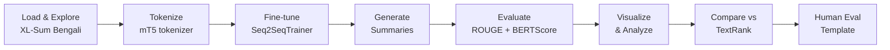

<div align="center">

# 📰 BanglaSum
### Abstractive Text Summarization for Low-Resource Bangla

*Fine-tuning mT5 on XL-Sum Bengali for fluent, faithful news summarization*

[](https://www.python.org/)
[](https://huggingface.co/csebuetnlp/mT5_multilingual_XLSum)
[](https://huggingface.co/datasets/csebuetnlp/xlsum)
[](#license)

</div>

---

## 📖 Overview

| | |
|---|---|
| 🎯 **Task** | Abstractive text summarization (Bangla) |
| 📚 **Dataset** | [XL-Sum (Bengali)](https://huggingface.co/datasets/csebuetnlp/xlsum) — news articles |
| 🧠 **Base model** | [`csebuetnlp/mT5_multilingual_XLSum`](https://huggingface.co/csebuetnlp/mT5_multilingual_XLSum) |
| 📊 **Metrics** | ROUGE-1/2/L, BERTScore (F1), TextRank baseline |
| 🧪 **Eval set** | 200 randomly sampled test articles |

---

## 📈 Results

<div align="center">

| Metric | Score |
|:---|:---:|
| ROUGE-1 | **0.2366** |
| ROUGE-2 | **0.0999** |
| ROUGE-L | **0.2097** |
| BERTScore F1 | **0.7586** |
| Avg. generated length | 14.78 words |
| Avg. reference length | 21.85 words |

</div>

> 📌 The fine-tuned model is benchmarked against a **TextRank extractive baseline** on a 50-sample subset — see [`model_comparison.csv`](model_comparison.csv).

---

## 🔄 Pipeline



1. **Explore** — article/summary length distributions, compression ratio
2. **Tokenize** — mT5 tokenizer (max input 512 tokens, max target 128 tokens)
3. **Fine-tune** — `mT5_multilingual_XLSum` with `Seq2SeqTrainer` (early stopping, beam search)
4. **Generate** — summaries on a held-out test sample
5. **Evaluate** — ROUGE-1/2/L and BERTScore
6. **Visualize** — training curves, score distributions, ROUGE-vs-BERTScore correlation, length analysis, boxplots
7. **Inspect** — qualitative review of best/worst summaries by ROUGE-1
8. **Compare** — against TextRank extractive baseline
9. **Export** — human evaluation template (Fluency / Adequacy / Conciseness / Faithfulness, 1–5 scale)
10. **Save** — predictions, metrics, and the fine-tuned model

---

## 📂 Project Structure

```
BanglaSum-Abstractive-Text-Summarization-for-Low-Resource-Bangla/
├── README.md                          # This file
├── banglasummarization-ab.ipynb       # Main Jupyter notebook with full pipeline
├── predictions.csv                    # Model predictions with ROUGE/BERTScore metrics
├── model_comparison.csv               # Comparison between fine-tuned model and TextRank baseline
└── human_evaluation_form.csv          # Template for manual evaluation (20 samples)
```

<details>
<summary><strong>📑 File descriptions</strong></summary>
<br>

| File | Description |
|---|---|
| `banglasummarization-ab.ipynb` | Complete end-to-end pipeline: data loading, preprocessing, fine-tuning, evaluation, visualization |
| `predictions.csv` | Generated summaries with automatic metrics for all 200 test articles |
| `model_comparison.csv` | Side-by-side comparison of fine-tuned mT5 vs. TextRank on 50 samples |
| `human_evaluation_form.csv` | 20-sample template for human evaluation (Fluency, Adequacy, Conciseness, Faithfulness) |

</details>

---

## ✨ Key Features

- 🌐 **Multilingual mT5** — leverages a pre-trained multilingual model fine-tuned on XL-Sum
- 📐 **Comprehensive Metrics** — ROUGE (1, 2, L) + BERTScore for semantic similarity
- ⚖️ **Baseline Comparison** — TextRank extractive summarization as a reference point
- 👥 **Human Evaluation** — ready-made templates for manual quality assessment
- 📘 **Full Documentation** — detailed notebook with explanations and visualizations

---

## ⚙️ Dependencies

```bash
pip install transformers datasets rouge_score bert_score pandas numpy matplotlib seaborn
```

---

## 🚀 Usage

```bash
# 1. Open the notebook
jupyter notebook banglasummarization-ab.ipynb
# or run on Google Colab
```

1. Open `banglasummarization-ab.ipynb` in Jupyter or Google Colab
2. Follow the pipeline step-by-step:
   - Load and explore the Bengali XL-Sum dataset
   - Fine-tune the model or load pre-trained checkpoints
   - Generate summaries on test data
   - View automatic and qualitative results
3. Review predictions in `predictions.csv`
4. Use `human_evaluation_form.csv` for manual annotation

---

## 🏆 Results Summary

- **Model Performance** — fine-tuned mT5 achieves ROUGE-1 of **0.2366**, BERTScore F1 of **0.7586**
- **Baseline Comparison** — clearly outperforms the TextRank extractive baseline (ROUGE-1: 0.24 vs 0.0)
- **Length Analysis** — generated summaries average 14.78 words vs. 21.85 for references, showing effective compression

---

## 👤 Author

**Abu Bakar Rakib**

## 📜 License

Open for educational and research purposes.

---

<div align="center">
<sub>Built with 🤍 for low-resource Bangla NLP research</sub>
</div>

Open for educational and research purposes.
